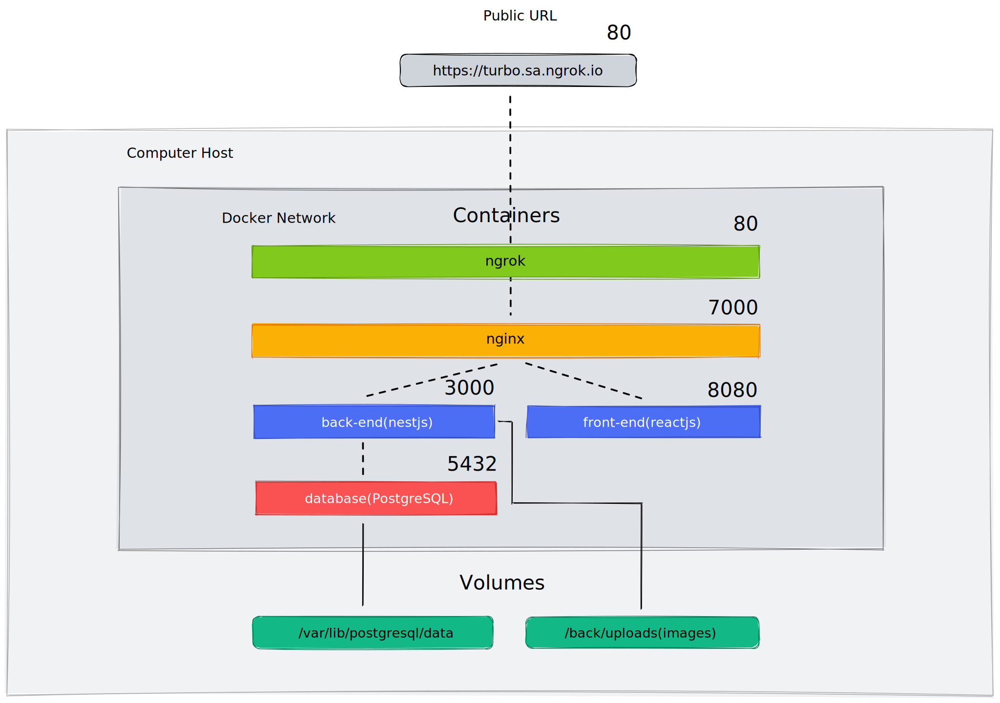
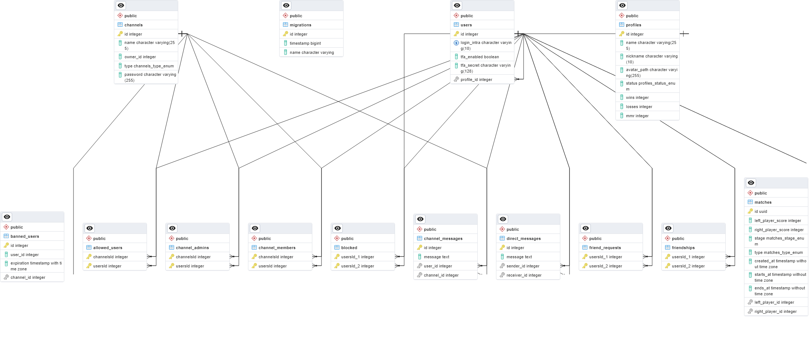
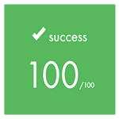

# ft_transcendence
This project is about creating a website for the mighty [Pong](https://en.wikipedia.org/wiki/Pong) contest!

### What is ft_transcendence?
ft_transcendence is an individual project at [42](42sp.org.br) which requires that we build an online platform to play [Pong.](https://en.wikipedia.org/wiki/Pong)

The backend must be built using [NestJS](https://nestjs.com/), the [frontend](https://en.wikipedia.org/wiki/Frontend_and_backend) in any [TypeScript](https://www.typescriptlang.org/) framework of your choice and the database must be [PostgreSQL.](https://www.postgresql.org/) For the [frontend](https://en.wikipedia.org/wiki/Frontend_and_backend), the chosen option was [React](https://reactjs.org/), due to its popularity and extensive documentation.

There are no restraints in regards to external libraries and the website but it needs to be a [single-page application.](https://en.wikipedia.org/wiki/Single-page_application) It should be compatible with [Google Chrome](https://www.google.com/intl/en-US/chrome/) and the other optional browser.

The user must log in using the OAuth system of [42 intranet](https://intra.42.fr/) and be able to enable a [two-factor authentication](https://authy.com/what-is-2fa/) method, for which we chose the [Google Authenticator App.](https://play.google.com/store/apps/details?id=com.google.android.apps.authenticator2&hl=en_US&gl=US)

Overall, the platform should have a ranking system, chat channels, private messages, profile editing, view users status and add other members as friends.

The platform should have a ranking system, chat channels, direct messaging and allow, user status changes, friend features and some profile customization options.

The main purpose is to play an implementation of [Pong](https://en.wikipedia.org/wiki/Pong), as if it was [1972.] all over again(https://www.youtube.com/watch?v=fiShX2pTz9A) There should be a few customization options such as custom maps or power-ups but the user should still be able to play the original version.
A spectator system must be implemented, spectators are able to watch the match without interfering with it.

Finally, the server structure must be containerized using [docker](https://www.docker.com/) and available with a single call of: **docker-compose up --build**.

### Overview


### Server Structure (Production)


### Database Schema
Click [here](./images/database2.png) to view full image.



### Badge


#### Skills
- Rigor
- Group & interpersonal
- Web

#### My grade



## Getting started (Staging)
**Follow the steps below**
```bash
# Clone the project and access the folder
git clone https://github.com/paulo-santana/ft_transcendence ft_transcendence && cd ft_transcendence/

# Register a new application in 42 intra
# create a .env file with your app info into the back, front and project root folder
# examples are given in .env.example in each folder

# Run make install to install the packages
make install

# Run make up so you can build the images
# and run the containers in dev mode
make up

# Access the login page using the URL below
# Log in using your 42 account or one of the example accounts
http://localhost

# Run make down to stop running containers
make down

# Alert!
# This will clean up all your docker related files and containers
# Use this if you really want to clean your machine
make fclean

# Well done!
```

## Updating

The project is regularly updated with bug fixes and code optimization.

## 📝 License

This project is licensed under the GNU General Public License v3.0 - see the [LICENSE](LICENSE) file for details.

---

Made by:
João Rodriguez 👋 [See my github](https://github.com/VLN37)<br/>
Paulo Santana 👋 [See my linkedin](https://www.linkedin.com/in/paulostn/)<br/>
Welton Leite 👋 [See my linkedin](https://www.linkedin.com/in/welton-leite-b3492985/)<br/>
